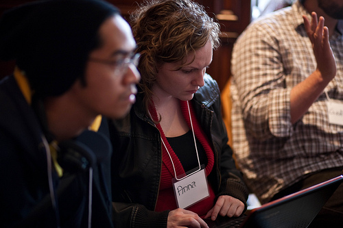
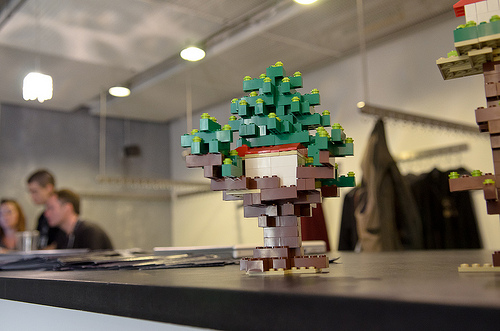
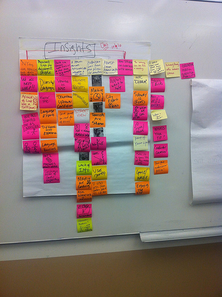

# Engaging Facilitation
#### For Inspired Learning

Truly engaging facilitation builds empathy for the participants in the room - with collaboration and creativity as core mechanisms for creating inspired learning experiences.
 
With this in mind, here’s a guide for developing sessions that focus on supercharging your participants’ learning success.

### Visualize Your Audience & Set Personal Goals

** [Dreambeat Toronto](https://www.flickr.com/photos/marksurman/) by Mark Surman CC BY 2.0**

Even with excellent content, facilitators can miss their mark. Visualization and goal setting with your audience in mind will help set you up for success. 

**To start, write down who your audience will definitely be and who your audience might be.**

#### Example

>I am running a 'Design Thinking' workshop at my university.

> **My audience will be:**
> Students interested in innovation and/or design processes.

> **My audience might also include:** Faculty interested in learning more about design thinking as something they might integrate into their classroom.

Writing these statements allows us to clearly focus on learning goals for these two audiences. While the majority of the focus will be on students, it is helpful to think about other audience members who might be in the room, and how to be more inclusive of their perspectives.

**Now, write down personal facilitation goals and goals for ensuring creating empathy for your identified audiences.**

#### Personal Facilitation Goals - Suggested

> * Ensure all voices are heard.
>* Don’t be defensive - if someone doesn’t understand your directions, embrace this as an opportunity to improve.
> * Be comfortable with uncomfortable silences - these often give > people time to find confidence to speak.
> * Be open to process changes proposed by the group and use your > * > intuition as a guide for what may or may not make sense in evolving > your session in real-time.
> * Allow yourself to say ‘I don’t know’ or defer questions when > needed.
> * Walk the space - move away from podiums, stages and single-locations. Vary your position in the room throughout the session.
> * Find ways to structure activities so that ideas from each person are presented in front of groups, even if people aren't comfortable voicing their ideas themselves.

#### Goals for Audience - Example

> * Understand what students hope to use ‘Design Thinking’ for, and try to use examples in my session that support those goals.
> * At the beginning of the session, clarify what Design Thinking is and isn’t.
> * Invite faculty to share differences between Design Thinking and other methods with which they have prior experience.

## Preparing

[Write it down Kit](https://www.flickr.com/photos/baileydoesntbark/) by Re Jin Lee CC BY-NC-ND 2.0

Preparing is about more than just purchasing materials and checking technical requirements (although you should do those things!). It’s also an important step in designing an experience for the people in your session. That experience starts with you:

Preparing is about more than just purchasing materials and checking technical requirements (although you should do those things!). It’s also an important step in designing an experience for the people in your session. That experience starts with you:
 
### Preparing  You
 
If you are new to the workshop, or you have created a version of the workshop based on your audience, take time to practice in front of a mirror. Even better, record a video of yourself presenting the main points of the workshop. 

Practicing and reflection helps you in two ways. First, you will recognize areas in which you can improve, and practicing the presentation will also boost your confidence when you deliver the material. The more you familiarize yourself with the content of the workshop, the more you gain ‘muscle memory,’ which will make you more comfortable and relaxed in your session.
 
### Preparing Content
 
Even if you already have notes for the workshop you facilitate, your job is to evaluate the appropriateness of the presentation content for your audience, and to individualize the content based on where and to whom you will be presenting. In some cases, the content of a workshop might not be culturally relevant, and removing or updating the presentation in advance will save you the struggles of presenting irrelevant or culturally insensitive information.
 
**Tips for preparing content:**
 
Review and edit content for context - including any language that might compromise the inclusivity of the session - like language that stereotypes gender or race.

Review content for timing - will it work with the schedule you have? If not, which parts can you cut or trim to ensure you won’t rush through important sections?

Avoid or limit presentation material like slide-decks.
Have a backup plan in case the Internet does not work – do you have a way to conduct the presentation offline?

Make sure there aren’t too many discussion-based activities that are biased towards extroverts. As much as possible, help people actively respond to prompts in creative and collaborative ways (i.e. ways that don’t involve participants speaking to the group as a whole). 

It's often valauble to create short feedback survey (3-4 questions) to share with participants after the session.
 
### Preparing Participants
                  
If you have your participants’ contact information in advance, this is a fantastic opportunity to send them pre-work, pre-reading and important context for your workshop.  Some suggestions:

Send out an agenda and helpful reading material in advance.
Ensure your agenda has ample breaks.
Include a Code of Conduct and/or Participation Guidelines in pre-session communication.
Provide any suggested reading, videos or resources that will get them excited and ready for the experience.
Provide information on the necessary technical requirements of the workshop. If the goal of your workshop is to teach people how to build something, make sure participants know what to bring with them, or know what software they will need on their laptops prior to arrival.
 
### Preparing Space

How you set up a room determines how well your session will go. Here are some things to keep in mind.
 
* Is the room big enough for a large group discussion?
* Is there room for participants to break into smaller groups if need be?
* How can you set up a room so that everyone can see the chalkboard/flipchart/video/slides?
* In peer to peer learning, it’s important that everyone is able to see each other - if they can see each other’s faces, it makes it much easier to start sharing ideas and working together.
 
As far in advance as possible, decide on a setup that will work best for collaborative learning and activities.  Here are some suggestions:

#### U-Shape

**Advantages**: Facilitator can easily walk around and make eye contact with all participants.

**Disadvantages**: Participants sitting in row seats might not have eye contact with each other, fewer people can fit in the room, harder to manage breakout groups

#### Without Chairs (on the ground)

** Advantages:** Equalizes power relationships, allows for self-organizing.

** Disadvantages:** Not all participants can comfortably sit on the floor, less eye-contact.

### Conference Table or Full Circle (with no table)

**Advantages:** More participants will be able to make eye contact, useful for plenary group discussions.

** Disadvantage** : Sub-conversations may form as ‘pockets’ that you will need to manage.

**Disadvantage (with table)**: Cannot break into groups easily, limited seats.

### Table Trios

**Advantages:** Trios are close to each other, good for small participatory workshops, allows for conversations between people at different tables.

**Disadvantage:** Doesn’t work for really large groups, tables take up a lot of space.

#### Bonus Tip

[Tree House Launch](https://www.flickr.com/photos/placenamehere/) Chris Casciano CC BY-NC 2.0

In addition to your supply list, consider bringing items people can interact with during breaks. That might be Legos, playdough, paper & markers, etc. Creating non-structured, interactive spaces helps people de-stress and share creatively.

## Session Opening!

With your incredible preparation, the session opening will allow you to welcome your participants and lay the groundwork for a successful experience. This is also a time during which you should learn about the individuals in the room, and help them learn about each other.
 
####First things first!
 
* Introduce yourself, provide an overview of the session and talk about the goals of the session.
* Provide logistics and rules of your session. 
Point to your agenda, code of conduct and review any other emergency information relevant to your location.
* Introduce the ‘Rule of Mobility’ to support introverts or people who may be nervous. Make it clear that everyone is welcome to take time for themselves at any point if they need it.
* Let everyone know when breaks will be.
* Restrict all use of technology unless it is part of your session. If you don’t call this out, people will be on their phones or laptops as a habit.
* Invoke the rule of “Step Up, Step Down.” Ask people who find themselves talking a lot to “step down” to create room for others to speak. Ask people who usually find themselves not talking to “step up,” and make sure their voices are heard.

#### Introductions

There are many great opening icebreakers - consider the cultural diversity and number of people in the room.  

A great opening gives people the opportunity to provide a short introduction, with a response to this prompt:

> share something you're ‘bringing’ to this session.
> share something tiy hope to ‘take or learn’ from the session. 

Keep responses in mind as valuable insight for the rest of the session.  

## Group Strengthening

[Group Photo](https://www.flickr.com/photos/bobchao/) by Bob Chao CC BY-SA 2.0

As people work in groups, they tend to take on certain group roles. Some people will fill many roles, whereas some might stick closely to one or two. As you observe the group, ask yourself which roles are being filled and which roles might be lacking.
 
Some of the more common group roles are:
 
* **Encourager** - Friendly and responsive, offers praise and accepts points of view of others.
* **Initiator** - Proposes tasks or goals, suggests ways to solve problems.
* **Information or Opinion Giver** - Offers facts, states beliefs or opinions.
* **Diagnostician** - Helps the group identify where problems are occurring, or opportunities exist.
* **Follower** - Goes along with all being proposed, and passively agreeable.
* **Disruptor** - Takes focus away from group to self.
 
Group dynamics will falter if, for example, there are too many followers, or no encouragers. Encourage people to step into certain roles, or fill them yourself to get people moving.

Disruptors can be challenging, and your role is to help groups sustain their focus. One way to do this is by encouraging participants to continue any off-topic conversations during breaks. This ensures that people still feel heard, but that the side conversations don’t derail the goals of the session. 

**Don’t be afraid to call out disruptors, reminding them to ‘step back’ and create space for those who aren’t speaking.**
 
#### Other group strategies:
 
* **Encourage individual brainstorming** before initiating group brainstorms to encourage better group discussion. This simply means that you ask people to consider a problem, question, or challenge for a couple of minutes before sharing their ideas with others.

* **Mix up how you 'group' people** throughout different activities so everyone can benefit from the diverse perspectives in the room.
If someone is talking too much, roams off topic, or if a disagreement becomes heated, try to pull out the main point of the issue, and suggest these are topics that be continued afterwards.
Time your activities in a way that allows for everyone to provide input.
 
* **If someone is talking too much**, roams off topic, or if a disagreement becomes heated, try to pull out the main point of the issue, and suggest these are topics that be continued afterwards.

* **Time your activities** in a way that allows for everyone to provide input.

[Design Thinking Subway Project](https://www.flickr.com/photos/palomabaytelman/10299923685/sizes/m/) by Paloma Beytelman CC BY-NC 2.0

As you build toward your final outcome, those ‘aha’ moments, and inspiration:

* **Embrace your role** in getting people inspired. Try to push participants in different directions and offer a different perspective if they seem to be struggling in one area.

* **Keep questions general where possible** – “What did that feel like?” or “How did that challenge, change or reinforce the idea you had?” “What if the opposite was true?”

* **Listen and watch** - reach out to people who seem to sit on the edges of their group, or otherwise are disengaged and try to understand what their blockers are.

* **Keep your agenda as hackable as possible** by allowing for feedback and letting people change processes in ways that help them feel successful without derailing your own goals.

* **During scheduled breaks, use this time to talk to people** in the group you haven't heard from and learn from their feedback. This will also help them feel more connected to you and more likely to speak up in the coming activities.

* **If you see someone demonstrating an outcome or behavior** you are looking for—in other words, leading by example--call them out, and use them as an example for others still struggling.
 
# Wrapping
Leave time at the end to do an open recap of what people valued about the experience and about each other using soft-prompts with a positive-lean. If your group is small, set boundaries for feedback (in one sentence tell us _____”).
 
Here are some suggestions:
 
> * In the opening circle we shared what we wanted to learn, or take from this session, and what we hoped to give. How did that go?”
> * What are you most grateful for in our session today - could be a person, or an experience, or inspiration”.
 
Use the final moments to cover any follow-up activities like surveys.

# Thank You!

We hope this  guide will help you deliver valuable experiences for your participants, and provide you with the confidence you need to step into our role as a fabulous facilitator!

-----

Credits:
Room Configurations & Group Roles  - Engineers Without Borders P2P Learning

 
